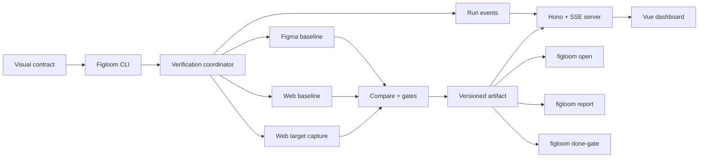
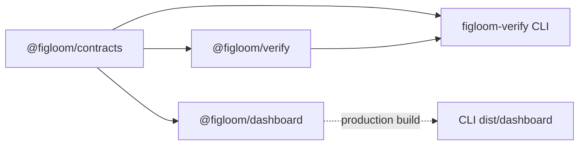

# Figloom

Visual verification product for Figma-to-web and web-to-web workflows.

## Architecture

Figloom keeps verification engine independent from presentation. CLI coordinates runs, owns HTTP/SSE runtime, and persists portable artifacts. Dashboard renders live events or completed artifacts; it never performs capture or comparison.



Artifact remains source of truth. Live events only update progress before final artifact lands. No database, hosted service, account, or cloud state.

### Runtime modes

| Command | Engine run | Server | Browser UI | Output |
| --- | --- | --- | --- | --- |
| `figloom verify` | Yes | No | No | JSON artifact + exit code |
| `figloom verify --ui` | Yes | Yes | Live dashboard | JSON artifact + live events |
| `figloom open` | No | Yes | Archived dashboard | Existing artifact |
| `figloom report` | No | No | Portable static dashboard | Static report directory |
| `figloom done-gate` | No | No | No | Independent persisted-evidence verdict |

## Workspace

```text
apps/
└── dashboard/           # Vue/Vite + Nuxt UI; depends only on contracts
packages/
├── contracts/           # versioned request, artifact, dashboard, event contracts
├── verify/              # capture, baseline, compare, gates, coordinator
└── cli/                 # figloom binary, Hono/SSE runtime, static report
    └── dist/dashboard/  # generated dashboard bundled in npm package
```

Package dependency and build direction:



`figloom-verify` remains public compatibility package and CLI distribution. It re-exports `@figloom/contracts` and `@figloom/verify`; dashboard source never imports CLI or engine internals.

## Development

Requirements: Node.js 22.13+, pnpm 11.18+, Chromium for Playwright.

```bash
pnpm install
pnpm exec playwright install chromium
pnpm validate
```

### Preview dashboard

Run dashboard with mock evidence and HMR; no contract or backend required:

```bash
pnpm dev:dashboard
```

Open URL printed by Vite. Mock covers passed, failed, blocked, Figma baseline, web baseline, viewport capture, and element capture.

### Run full product

Build dashboard bundled into CLI:

```bash
pnpm build
```

Run verification with dashboard:

```bash
pnpm figloom verify \
  --project-root "$PWD" \
  --contract /absolute/path/to/visual-contract.json \
  --output /absolute/path/to/visual-verification.json \
  --ui
```

Figloom prints dashboard URL and opens browser. Process stays alive until `Ctrl+C`. Add `--no-open` when browser should not open automatically.

Open existing artifact without rerunning verification:

```bash
pnpm figloom open \
  --artifact /absolute/path/to/visual-verification.json
```

### Run dashboard with HMR

Use mock mode above for normal UI work. To debug real artifact/API integration, start archived dashboard backend first:

```bash
pnpm build
pnpm figloom open \
  --artifact /absolute/path/to/visual-verification.json \
  --no-open
```

Command prints backend URL such as `http://127.0.0.1:43127`. Keep process running. In second terminal, pass URL to Vite proxy:

```bash
FIGLOOM_API_ORIGIN=http://127.0.0.1:43127 pnpm dev:dashboard
```

Open Vite URL, normally `http://localhost:5173`. Vite proxies `/api`, `/artifacts`, and `/events` to CLI backend; Vue changes update through HMR.

### Common checks

```bash
pnpm typecheck
pnpm test
pnpm build
pnpm validate
```

Inspect CLI commands:

```bash
pnpm figloom --help
```

Detailed contract, command, artifact, and dashboard documentation lives in [`packages/cli/README.md`](packages/cli/README.md).

Dashboard-specific development and HMR instructions live in [`apps/dashboard/README.md`](apps/dashboard/README.md).

## Repository boundary

This repository owns verification engine, CLI, dashboard, artifacts, tests, and npm releases. Agent skills and plugin adapters remain in `hungify/skills` and consume released `figloom-verify` commands.
