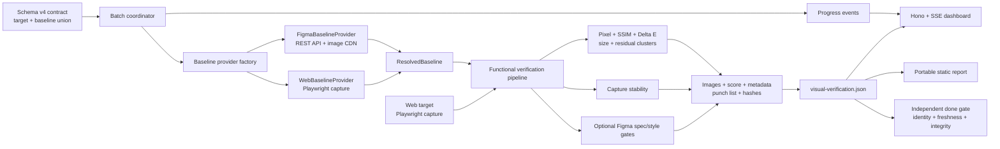
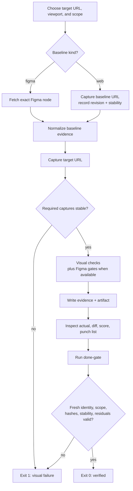

# figloom-verify

CLI-first visual verification for Figma-to-web parity and web-to-web regression.

Figloom resolves a typed baseline, captures a deterministic web target, compares multiple visual signals, and writes machine-readable evidence for human review and CI gates.

## Supported modes

| Mode | Baseline | Target | Extra gates |
| --- | --- | --- | --- |
| Figma vs web | Exact Figma `fileKey` + `nodeId` | Rendered web URL | Figma geometry, typography, and color |
| Web vs web | Rendered baseline URL + declared revision | Rendered web URL | Stability for baseline and target |

Web baseline `revision` is provenance supplied by caller, such as `git:a1b2c3d` or a deployment ID. Figloom records and verifies it across artifacts; it cannot prove a URL serves that revision.

Visual verification proves rendered parity only. It does not prove behavior, accessibility, component reuse, or implementation quality.

## Architecture

Figloom uses OOP only at stateful acquisition boundaries. Core verification remains a functional pipeline with typed inputs and outputs.



Key boundaries:

- `BaselineProvider` owns source-specific I/O and provenance.
- `FigmaBaselineProvider` fetches fresh node render and exposes Figma identity capability.
- `WebBaselineProvider` captures reference URL with same viewport/scope and checks its stability.
- `runVerification` consumes only `ResolvedBaseline`; comparison and reporting do not depend on acquisition source.
- Figma spec/style gates run only when resolved baseline exposes Figma identity.
- `done-gate` reparses persisted files and never trusts in-memory verdict.

## Verification flow



## Requirements

- Node.js 22.13 or newer.
- Chromium installed through Playwright.
- Target and baseline web applications reachable from Playwright.
- `FIGMA_ACCESS_TOKEN` only for Figma baseline contracts.
- Deterministic route state, fonts, data, animations, viewport, and feature flags.

Figloom does not start applications. Start required servers before verification.

## Install

Package is published as `figloom-verify`. During repository development, run from repository root with `pnpm figloom`.

```bash
npm install --save-dev figloom-verify
npx playwright install chromium
npx figloom status --project-root "$PWD"
```

Create an initial schema-v4 contract interactively:

```bash
npx figloom init
```

By default this writes `.figloom/visual-contract.json`. Use `--output <path>` to choose another location. Existing files require explicit `--force`.

Set Figma token only when using Figma baselines:

```bash
export FIGMA_ACCESS_TOKEN="your-token"
```

## Contract

Store contracts and outputs under `.figloom/artifacts/visual-verifications/`.

### Figma vs web

```json
{
  "schemaVersion": 4,
  "target": {
    "kind": "web",
    "url": "http://127.0.0.1:3000/login"
  },
  "contracts": [
    {
      "id": "login.desktop",
      "baseline": {
        "kind": "figma",
        "fileKey": "abc123",
        "nodeId": "153:5181"
      },
      "viewport": { "name": "desktop", "width": 1440, "height": 1024 },
      "outDir": ".figloom/artifacts/visual-verifications/login/desktop",
      "scope": {
        "kind": "page",
        "pageReason": "Supplied node represents complete login screen."
      }
    }
  ]
}
```

Every run fetches fresh Figma evidence. Retryable Figma API failure never silently reuses cached gold.

### Web vs web regression

```json
{
  "schemaVersion": 4,
  "target": {
    "kind": "web",
    "url": "http://127.0.0.1:3000/login"
  },
  "contracts": [
    {
      "id": "login.desktop.regression",
      "baseline": {
        "kind": "web",
        "url": "https://production.example.com/login",
        "revision": "git:a1b2c3d"
      },
      "viewport": { "name": "desktop", "width": 1440, "height": 1024 },
      "outDir": ".figloom/artifacts/visual-verifications/login/regression-desktop",
      "scope": {
        "kind": "page",
        "pageReason": "Compare complete login page across deployments."
      }
    }
  ]
}
```

Baseline and target use same viewport, scope, selector, timeout, and devtools-hiding controls. Final verification samples both web renders for stability. Unstable baseline blocks pass.

### Region scope

Use region scope for component or bounded content:

```json
{
  "kind": "region",
  "selector": "[data-testid='login-form']",
  "expectSize": { "width": 480, "height": 560 }
}
```

Selector must resolve exactly once. Final region evidence uses `component/strict`.

### Masking dynamic content

Add `maskSelectors` (up to 10 CSS selectors) to a contract to blank out timestamps, avatars, or other content that changes between runs, before both the baseline and actual capture are diffed:

```json
{
  "id": "dashboard.desktop",
  "maskSelectors": ["[data-testid='last-updated']", ".user-avatar"]
}
```

Masked elements are overlaid with a solid box on both sides of the comparison, so genuinely dynamic regions no longer produce false diffs. `figloom done-gate` rejects evidence whose `maskSelectors` do not match the contract.

`maskSelectors` requires a `web` baseline — masking runs through Playwright during capture, so a `figma` baseline has no masking path and the contract rejects `maskSelectors` in that case.

## Run verification

```bash
npx figloom verify \
  --project-root "$PWD" \
  --contract .figloom/artifacts/visual-verifications/login/visual-contract.json \
  --output .figloom/artifacts/visual-verifications/login/visual-verification.json
```

Run same engine with live dashboard:

```bash
npx figloom verify \
  --project-root "$PWD" \
  --contract .figloom/artifacts/visual-verifications/login/visual-contract.json \
  --output .figloom/artifacts/visual-verifications/login/visual-verification.json \
  --ui
```

Use `--no-open` to keep server running without opening browser. Dashboard reads in-memory progress plus canonical artifacts; no database, account, or cloud service.

Open completed artifact without rerunning:

```bash
npx figloom open \
  --artifact .figloom/artifacts/visual-verifications/login/visual-verification.json
```

Export portable static report into empty directory:

```bash
npx figloom report \
  --artifact .figloom/artifacts/visual-verifications/login/visual-verification.json \
  --output ./figloom-report
```

Serve exported directory over HTTP. Browsers block report JSON loading through `file://`.

Inspect every `actual.png`, `diff.png`, `visual-score.json`, and `punch-list.json`. `allPassed=true` does not replace image inspection.

Then run independent integrity gate:

```bash
npx figloom done-gate \
  --artifact .figloom/artifacts/visual-verifications/login/visual-verification.json
```

## Evidence layout

Figma baseline output:

```text
figma-gold.png
figma-gold.meta.json
actual.png
diff.png
visual-score.json
run-meta.json
punch-list.json
```

Web baseline output replaces first two files with:

```text
web-baseline.png
web-baseline.meta.json
```

`visual-verification.json` records exact request, resolved project root, per-contract result, and output directories. CLI output adds absolute `artifactPath` and SHA-256 `contentHash`.

## Commands

| Command | Purpose |
| --- | --- |
| `figloom status` | Show CLI version, project root, and optional Figma token availability. |
| `figloom verify` | Resolve Figma or web baseline, capture web target, compare, and write batch artifact. |
| `figloom open` | Open archived artifact in dashboard without rerunning. |
| `figloom report` | Export portable static dashboard for CI artifacts. |
| `figloom done-gate` | Revalidate persisted evidence before handoff or CI approval. |
| `figloom fetch-gold` | Fetch one Figma PNG for diagnosis. |
| `figloom run` | Run legacy low-level Figma comparison for diagnosis. |
| `figloom compare` | Compare two existing PNG files without source provenance gates. |

Normal workflow uses `verify` then `done-gate`. Low-level commands exist for diagnosis.

## Exit codes

| Code | Meaning |
| --- | --- |
| `0` | Command completed and visual verdict passed. |
| `1` | Verification completed, but one or more visual contracts failed. |
| `2` | Usage, schema, environment, or execution error. |

Exit `1` is valid comparison result, not infrastructure failure.

## Deterministic capture

- Pin browser build, operating system, fonts, viewport, and device scale factor.
- Disable timers, random values, unstable network content, and animations.
- Keep selectors, expected sizes, application state, and revisions explicit.
- Require repeated captures to remain stable.
- Never loosen threshold only to make one failing run pass.
- Use one pinned environment when calibrating shared thresholds; OS font rendering can differ.

## CI example

```yaml
- name: Install Figloom browser
  run: npx playwright install --with-deps chromium

- name: Verify visual parity
  env:
    FIGMA_ACCESS_TOKEN: ${{ secrets.FIGMA_ACCESS_TOKEN }} # omit for web-only contracts
  run: |
    npx figloom verify \
      --project-root "$PWD" \
      --contract .figloom/artifacts/visual-verifications/login/visual-contract.json \
      --output .figloom/artifacts/visual-verifications/login/visual-verification.json
    npx figloom done-gate \
      --artifact .figloom/artifacts/visual-verifications/login/visual-verification.json
```

Upload `.figloom/artifacts/visual-verifications/` as CI artifact on failure.

## Troubleshooting

- Figma auth failure: run `figloom status`; confirm token access to file.
- Chromium missing: run `npx playwright install chromium`.
- URL unreachable: start app and test URL from same environment.
- Selector failure: use deterministic unique selector such as `data-testid`.
- Unstable result: check fonts, timers, random data, API responses, animations, browser, viewport.
- Exit `1`: inspect `diff.png`, then score and punch list.

## Security and artifacts

- Keep `FIGMA_ACCESS_TOKEN` in ignored environment files or CI secrets.
- Never commit tokens or place them in contracts.
- Treat web screenshots and Figma metadata as potentially sensitive.
- Apply repository retention rules before sharing generated evidence.

## License

MIT
